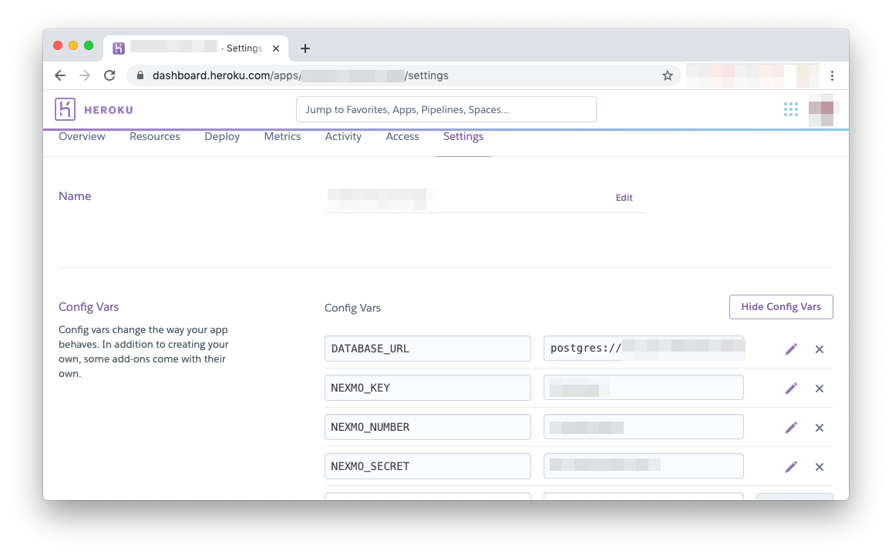

# Docker implementation of SMS-based Queue Manager

This repo builds upon the code found [here](https://github.com/nexmo-community/sms-queue-notify), providing a Dockerfile to easily deploy a basic Python queue-manager application. You can read the [full blog post](https://www.nexmo.com/blog/2020/02/07/dockerize-python-queue-manager-project-for-easy-deployment-dr) for details about how the Dockerfile is put together.

## Getting started

Clone this repo:

```
git clone https://github.com/nexmo-community/docker-queue-manager.git
cd docker-queue-manager
```

Make sure Docker is running on your computer, then enter the following to build the Docker image:

```
docker build --tag queue-app .
```

## Run locally

If you'd like to run locally, you'll first need to prepare a few environment variables. First, rename the `.env_sample` file to `.env`, then populate with your Nexmo information. Then, enter the following in your terminal:

```
docker run -d -p 5000:5000 --env-file .env -e PORT=5000 -e DATABASE_URL=sqlite:///queue.db -e PYTHONUNBUFFERED=0 queue_app
```

The project requires a PORT and DATABASE_URL, which would be provided automatically if deploying to Heroku. For local testing this will be enough to create a SQLite database in the container, but this database will not persist after the container is stopped.

To fully test, you will need to use ngrok to provide a publically accessible URL for your app. In another terminal window, type the following:

```
./ngrok HTTP 5000
```

Copy the HTTPS forwarding URL and paste into the "Inbound Webhook URL" field under the settings for your Nexmo number. It should look like this:

```
https://<your ngrok url>/webhooks/inbound-sms
```

## Deploy to Heroku

Before you can deploy to Heroku, you'll need to make sure you have the Heroku CLI and that you are logged in. Once you've done that, create an application and a Postgres DB for your app:

```
heroku create <your application name>
heroku addons:create heroku-postgresql:hobby-dev -a <your application name>
```

Now you'll want to update your Heroku config variables with your Nexmo credentials:



Then, login to the Heroku container registry and push and release your Docker image:

```
heroku container:login
heroku container:push web -a <your application name>
heroku container:release web -a <your application name>
```

As a last step, make sure you update your Nexmo number settings with your Heroku app's URL:

```
https://<your Heroku url>/webhooks/inbound-sms
```
